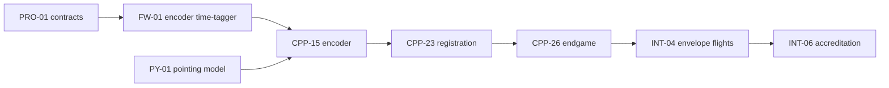

# ICS Build Plan: C++, TypeScript/React and Python

Sep 26, 2026 · @Matthew Kolakowski

## BLUF

Build ICS in 76 tasks across seven phases: 33 C++ tasks, 1 firmware task, 13 Python model tasks, 10 TypeScript/React tasks, and 19 foundation, contract and integration tasks. Lock the protobuf contracts first, write every algorithm in Python before porting it to C++, and field-test only after SITL and HIL pass. The critical path runs through encoder time-tagging and moving-camera registration, not the image algorithms. Path A completes in about 18 to 20 months; Path B adds about 4 months to Phase 4.

## Execution instructions

- **Lock contracts first.** Merge PRO-01 to PRO-03 before any parallel work starts. Every service, model and screen compiles against the same generated types.
- **Build path-independent code first.** Finish Phases 1 and 2 before the OWLSS licensing decision forces a Path A or Path B choice in Phase 4.
- **Model in Python, then port.** Write each algorithm as a Python reference with golden output files. Port to C++ only when the reference is reviewed, and gate the port on parity tests.
- **Integrate on the bench.** Run every service against SITL and the HIL replay bench before field time.
- **Validate in order.** Run field events V0 through V5 in sequence; each event gates the next.
- **Keep safety-critical control in C++.** Mount motion, the sun interlock and triggering live only in C++ services. The web UI stays read-only toward instrumentation; operators command stations from the station console.
- **Use the task card.** Open every task with the card below and implement only after approval.
- **Close with the Definition of Done.** No task merges until every item passes.

### Task card (open every task with this)

| Field | Content |
|---|---|
| Goal | One paragraph restating the task and its acceptance criteria |
| Blocking questions | Zero to three, each with a recommended default |
| Assumptions | Up to five, falsifiable, each naming the design decision it drives |
| Plan | Files, key signatures, order of work, and alternatives rejected |
| Close-out | Assumptions that held or broke, plan changes, untested areas, most likely defect |

### Definition of Done

- [ ] Tests merged: ≥90% line coverage on new C++ and Python code, ≥80% on UI code.
- [ ] Static analysis clean with zero suppression markers in any language.
- [ ] Sanitizer builds clean; every new parser fuzzed for at least one hour.
- [ ] Functions ≤50 lines; no recursion; all types explicit.
- [ ] SBOM and provenance attestation generated by the pipeline.
- [ ] AI-assisted changes labeled and reviewed by a human (DoWI 8430.01 §3.6).
- [ ] C4 or validation-criterion traceability updated where the task touches a measured quantity.

## Repository layout and language boundaries

Use one monorepo so contracts, golden files and all three languages version together.

```text
ics/
  proto/          protobuf contracts, the single source of truth
  schemas/        run-record JSON Schema keyed to C4 IDs
  golden/         cross-language golden test vectors
  cpp/
    common/ camera_io/ timing/ capture/ trigger/ pli/ mount/ tracker/ encoder/
    endgame/ registration/ detection/ association/ estimation/
    killclass/ footprint/ record/ api/
    services/     ics-timingd ics-capd ics-plid ics-mountd ics-trigd ics-camd
                  ics-api ics-recordd ics-pipeline
  firmware/
    encoder_tagger/
  python/
    ics_models/   pointing, calibration, trajectory, drag, footprint, killclass, uncertainty
    ics_synth/    synthetic engagement generator
    ics_stats/    Pk, timeline analysis, validation scorer
  web/            React and TypeScript application
  deploy/         containers, Envoy, systemd units, infrastructure as code
  docs/
```

| Language | Owns | Never does |
|---|---|---|
| C++ | Every real-time and production data path: timing, PLI, cameras, mounts, trigger, pipeline, records, query API | Model fitting or exploratory analysis |
| Python | Reference models, calibration fitting, synthetic data, statistics, validation scoring, ML training | Run in the live capture or control path |
| TypeScript/React | Operator status, quick-look, 3D and map views, evaluator workflow | Command mounts, cameras or triggers |

**Parameter hand-off.** Python exports versioned, schema-validated parameter files (pointing models, drag tables, kill thresholds) and ONNX models. C++ loads them at startup and records their SHA-256 hashes in every run record.

**Interface contracts.** Protobuf defines every message crossing a process or language boundary. C++ uses gRPC; the browser reaches ics-api through an Envoy gRPC-Web proxy; Python reads the same generated types for golden files and analysis.

## Coding standards by language

Apply the Power-of-Ten rules identically in all three languages, and enforce each one in CI rather than in review.

| Rule | C++ | Python | TypeScript |
|---|---|---|---|
| Simple control flow | No goto; no exceptions on real-time paths; tl::expected results | Early returns; typed result objects; no bare except | Guard clauses; async/await with try/catch; no floating promises |
| No recursion | clang-tidy misc-no-recursion | AST check in CI | Custom ESLint rule |
| Functions ≤50 lines | clang-tidy readability-function-size | Line-count check in CI | ESLint max-lines-per-function |
| Explicit types | No owning raw pointers; std::span | Full annotations; mypy --strict | strict: true; no any; no non-null assertion |
| Minimal global state | No mutable globals | No module-level mutable state | Module scope only; immutable updates |
| No suppressions | No NOLINT | No noqa or type: ignore | No eslint-disable or @ts-ignore |
| Error handling | [[nodiscard]] on every fallible call | Consistent exception hierarchy at boundaries | Typed errors at the API boundary |
| Network I/O | Bounded retry with exponential backoff | Bounded retry with exponential backoff | Bounded retry with exponential backoff |
| Data migrations | Additive and idempotent | Additive and idempotent | Not applicable |
| Static analysis | clang-tidy, cppcheck, CodeQL | ruff, mypy, bandit, CodeQL | ESLint, tsc, CodeQL |
| Tests | GoogleTest, libFuzzer, sanitizers | pytest, hypothesis | Vitest, Playwright |
| Supply chain | Conan lockfile; Syft SBOM | uv lockfile; Syft SBOM | pnpm lockfile; Syft SBOM |

All three pipelines produce the [DoWI 8430.01](https://www.esd.whs.mil/Portals/54/Documents/DD/issuances/dodi/843001p.pdf) evidence set: SBOM, signed provenance, static and dynamic analysis, and fuzz results.

## Phase 0: Foundation and contracts (months 1 to 2)

Stand up the repository, three toolchains, the evidence pipeline and the shared contracts before writing product code.

| ID | Task | Language | Depends on | Done when |
|---|---|---|---|---|
| FND-01 | Create the monorepo on a CUI-authorized host; mark CTI; set CODEOWNERS and branch protection | All | None | Merges need two approvals; CTI banner in README |
| FND-02 | Build C++ toolchain containers: GCC 13, Clang 17, CUDA 12, CMake presets, Conan 2 lockfile | C++ | FND-01 | A sample target builds reproducibly on both compilers |
| FND-03 | Encode the C++ Power-of-Ten profile: clang-tidy checks, -Werror, NOLINT ban, post-init allocation hook | C++ | FND-02 | CI fails on one seeded violation of each rule |
| FND-04 | Build the Python toolchain: 3.12, uv lockfile, ruff, mypy --strict, pytest, hypothesis, recursion check | Python | FND-01 | CI fails on an untyped function or a recursive call |
| FND-05 | Build the TypeScript toolchain: pnpm, Vite, React 18, strict tsconfig, ESLint, Prettier, Vitest, Playwright | TS | FND-01 | CI fails on any, !, var or a floating promise |
| FND-06 | Build the pipeline: build, unit, sanitizers, fuzz, clang-tidy, cppcheck, CodeQL, SBOM, cosign, in-toto provenance | All | FND-02 to FND-05 | Every merge publishes signed artifacts, SBOM and attestation |
| FND-07 | Open the dependency register per DoWI 8430.01 §3.5.i: governance, sustainment, license, foreign influence | All | FND-06 | Every direct dependency has a reviewed entry |
| FND-08 | Add AI-assist controls per §3.6: merge-request label, required human review, model and version log | All | FND-01 | Template blocks merge until the label is set |
| FND-09 | Publish the task card and Definition of Done in CONTRIBUTING | All | FND-01 | Every issue uses the card |
| PRO-01 | Define protobuf contracts: TimeQuality, PliRecord, PliEvent, MountSample, CameraFrameMeta, TriggerEvent, Track, Fragment, KillAssessment, Footprint, RunRecord | Proto | FND-01 | buf lint and buf breaking pass; C++, Python and TS code generated |
| PRO-02 | Publish the run-record JSON Schema keyed to C4 MOP and KPP IDs | Proto | PRO-01 | 20 sample records validate |
| PRO-03 | Fix frame and time conventions: WGS84, range ENU origin at the defended asset, UTC as int64 ns, ellipsoid heights | C++, Python | PRO-01 | Shared golden vectors pass in both languages |

## Phases 1 and 2: Core services and station control (C++, months 2 to 8)

Build the path-independent services first. Phase 1 covers timing, PLI and camera I/O; Phase 2 covers mounts, tracking and triggering.

### Phase 1: Timing, PLI and camera I/O (months 2 to 6)

| ID | Task | Depends on | Done when |
|---|---|---|---|
| CPP-01 | Build common: tl::expected errors, StaticVector and RingBuffer, units, spdlog logging, toml++ config | FND-03 | Full branch coverage; zero post-init allocations |
| CPP-02 | Build common/frames: WGS84, ECEF, ENU; MSL to ellipsoid through EGM96 | PRO-03 | Matches GeographicLib reference points within 1 mm |
| CPP-03 | Build ics-timingd: grandmaster lock, holdover and IRIG-B health | CPP-01 | Holdover flag within 1 s of GNSS loss on the bench |
| CPP-04 | Build the strobe latency analyzer: find PPS strobe frames; compute per-camera offset | CPP-03, CPP-12 | Offsets reported within 5 µs on the bench |
| CPP-05 | Capture pcap on TAP ports with NIC hardware time stamps | CPP-01 | 24 h capture with zero drops |
| CPP-06 | Build the MAVLink adapter: GLOBAL_POSITION_INT, GPS_RAW_INT, SYSTEM_TIME, ATTITUDE_QUATERNION, HEARTBEAT, COMMAND_LONG/ACK, STATUSTEXT | CPP-05 | PX4 and ArduPilot SITL replays match; 1 h fuzz clean |
| CPP-07 | Build the CoT adapter | CPP-05 | Fuzz clean; ce and le mapped to σ |
| CPP-08 | Build the Lattice StreamEntities adapter with a read-only token | CPP-05 | Runs against the vendor sandbox |
| CPP-09 | Build the SAPIENT (BSI Flex 335 v2.0) adapter | CPP-05 | ICD sample messages parse |
| CPP-10 | Import ULog and DataFlash logs; convert GNSS time to UTC | CPP-01 | Full-rate estimator states extracted from sample logs |
| CPP-11 | Build time alignment: boot-to-UTC offset and drift fit; residual offset report | CPP-06, CPP-10 | ≤1 ms error with injected drift on SITL |
| CPP-12 | Wrap the Phantom SDK: arm, multi-cine, trigger, trim, 10GbE offload, IRIG metadata | CPP-01 | Ten back-to-back segments offload with verified times |
| CPP-13 | Wrap the FLIR X6980-HS SDK | CPP-01 | Same test as CPP-12 |
| CPP-14 | Deliver ics-plid and ics-camd with gRPC interfaces from PRO-01 | CPP-06 to CPP-13 | SITL feed yields canonical PLI; one command arms all cameras |

### Phase 2: Station control (months 3 to 8)

| ID | Task | Depends on | Done when |
|---|---|---|---|
| FW-01 | Write encoder time-tagger firmware in C on an MCU or FPGA, disciplined by PPS and PTP | PRO-03 | Time-tag error ≤50 µs against injected PPS (C18) |
| CPP-15 | Build encoder: ingest time-tagged angles; interpolate to frame times; apply the pointing model | FW-01, PY-01 | ≤5 µrad error at 0.1 rad/s on the bench |
| CPP-16 | Build the PWI4 mount client: rate commands, limits, status | CPP-01 | Stable 20 to 50 Hz rate loop on a bench mount |
| CPP-17 | Build the sun keep-out interlock: solar ephemeris, 15° cone, command pre-emption, fail-safe on fault | CPP-16 | Randomized HIL commands never enter the cone; an ephemeris fault parks the mount |
| CPP-18 | Build the cue extrapolator: fuse PLI and radar in a constant-acceleration Kalman filter; output az, el and rates with latency compensation | CPP-11, CPP-16 | Pointing error <2 mrad on replayed tracks |
| CPP-19 | Build tracker: tracking-camera I/O through Aravis; 100 Hz centroid tracker with acquire and reacquire | CPP-16 | Holds a drone in the central half of the narrow field at 500 m (C19) |
| CPP-20 | Build the multi-target hand-off scheduler | CPP-18, CPP-19 | M-2 replay hands off within 3 s |
| CPP-21 | Build trigger: closest-approach predictor, arming state machine, BNC 577 SCPI control, UTC event log | CPP-11, CPP-14 | Fires within 1 ms of predicted time in replay |
| CPP-22 | Deliver ics-mountd for each station | CPP-15 to CPP-20 | Three stations track one target from one cue |

## Phase 3: Python models (months 2 to 10)

Build the reference models, calibrations and analysis tools that the C++ code ports and the Evaluator relies on. Run this phase in parallel with Phases 1 and 2; each model publishes golden files before its C++ port starts.

| ID | Task | Depends on | Done when |
|---|---|---|---|
| PY-01 | Fit the mount pointing model (TPOINT-style terms) from star calibration; export coefficients | PRO-03 | ≤10 µrad RMS on held-out stars (C17) |
| PY-02 | Fit camera intrinsics, distortion and narrow/wide/MWIR boresight offsets | PRO-03 | ≤0.5 px reprojection on held-out points (C3) |
| PY-03 | Model terrestrial refraction and turbulence from met profiles | PY-02 | Reduces RTK residuals on V2 data |
| PY-04 | Write reference trajectory models: 7-state ballistic, lift and flutter, IMM two-body; publish golden datasets | PRO-03 | Golden files merged; used by CPP-26 and CPP-28 parity tests |
| PY-05 | Fit the sUAS drag table by material class from V3 drops, with uncertainty | PY-04 | Median mass error ≤25% on the hold-out half (C10) |
| PY-06 | Write the footprint Monte Carlo reference with winds to 1,000 m | PY-04 | 85 to 95% of recovered pieces inside the 90% region (C11) |
| PY-07 | Study kill-class thresholds (N, m, T, residual gate) with ROC curves against truth pods; freeze them | PY-04 | Thresholds signed into Section 5.2 before scoring runs |
| PY-08 | Build the synthetic engagement generator: sky-background sequences with drones, interceptor and debris at known truth | PRO-01 | 200-sequence regression set at three slant ranges in CI |
| PY-09 | Train the airframe segmentation model; export ONNX with a model card and benchmarks (DoWI §3.6.e) | PY-08 | IoU ≥0.8 on labeled range imagery; card published |
| PY-10 | Propagate uncertainty: predicted σ versus slant range from all error sources | PY-01 to PY-03 | Matches the Section 4.2 table within 20% |
| PY-11 | Build the statistics package: Clopper-Pearson Pk, miss distance, timeline gates, MLCOA versus MDCOA deltas | PRO-02 | Reproduces hand-worked examples; feeds the C&L report |
| PY-12 | Build the validation scorer: compute C1 to C19 from V0 to V5 data | PY-01 to PY-11 | One command produces the accreditation criteria table |
| PY-13 | Build the debris source-term model for M&S by closing speed, geometry and target class | PY-05 | Exported table accepted by the M&S Analyst |

## Phase 4: Algorithms and products (C++, months 6 to 14)

Port each Python reference to C++ and gate every port on parity with its golden files. Tasks marked Path A/B change scope with the OWLSS licensing decision.

| ID | Task | Depends on | Done when |
|---|---|---|---|
| CPP-23 | Build registration: per-frame moving line of sight from encoder angles, pointing model and boresight; refraction correction (Path A/B) | CPP-15, PY-02, PY-03 | Sky-fiducial error meets C4 and C5 |
| CPP-24 | Build detection: CUDA negative-contrast detection on sky; MWIR hot-object detection (Path A/B) | CPP-12, PY-08 | ≥95% recall at ≤1 false detection per frame on the synthetic set |
| CPP-25 | Run the PY-09 segmentation model through TensorRT | PY-09 | Parity with ONNX output; ≤5 ms per frame |
| CPP-26 | Build endgame: IMM two-body tracker seeded by PLI; closest approach and contact time | CPP-23, PY-04 | Parity with PY-04; meets C7, C8 and C16 |
| CPP-27 | Build association: debris association across frames and stations; OWLSS adapter on Path A, full implementation on Path B | CPP-23, CPP-24 | Meets C9 on V3 data |
| CPP-28 | Build estimation: 7-state fit, lift and flutter, mass from β·A·Cd (Path A/B) | PY-04, PY-05 | Parity with PY-04; meets C10 |
| CPP-29 | Build killclass: ballistic-fit test, breakup count, mission-denial check | CPP-26, PY-07 | Meets C12 |
| CPP-30 | Port the footprint Monte Carlo | PY-06 | Parity with PY-06; meets C11 |
| CPP-31 | Deliver ics-pipeline: batch orchestration with checkpoints and bounded retry with backoff | CPP-23 to CPP-30 | Processes one run in ≤10 minutes on the field server |
| CPP-32 | Build record: run records, SHA-256 manifests, in-toto attestations; adapt the verdict evidence-chain design | PRO-02, CPP-31 | Records validate; any byte change breaks verification |
| CPP-34 | Deliver ics-api: read-only gRPC query service behind Envoy gRPC-Web | PRO-01, CPP-32 | UI contract tests pass |

## Phase 5: Front end (TypeScript and React, months 4 to 15)

Build a read-only operator and evaluator interface on ics-api. Serve all map tiles and assets locally; the range network allows no external calls.

| ID | Task | Depends on | Done when |
|---|---|---|---|
| UI-01 | Scaffold the app: Vite, React, strict TypeScript, router, design tokens; CAC/PKI authentication at the reverse proxy | FND-05 | Lint, type and axe accessibility checks pass |
| UI-02 | Generate the typed API client from PRO-01 (protobuf-es with Connect gRPC-Web); validate responses with zod at the boundary | CPP-34 | Contract tests pass; no untyped data reaches components |
| UI-03 | Build range status: stations, time quality, GNSS and holdover, mount pointing, sun cone, trigger state; server-pushed updates | UI-02 | ≤1 s display latency |
| UI-04 | Build the engagement timeline view with C4 time gates per run | UI-02 | Matches PY-11 output on sample runs |
| UI-05 | Build the run quick-look: kill class, miss distance ±σ, intercept point, coverage and reduced-truth flags | UI-02 | Available within 15 minutes of each run |
| UI-06 | Build the 3D engagement viewer in three.js: stations, trajectories, debris | UI-02 | 5,000 tracks render at ≥30 fps |
| UI-07 | Build the footprint map in MapLibre with offline tiles: 50, 90 and 99% polygons and keep-out areas | UI-02 | Renders with zero external network calls |
| UI-08 | Build imagery review: frame scrubber over server-transcoded clips with track overlays | UI-02 | Overlays align to the frame |
| UI-09 | Build the evaluator workflow: Section 5.2 sign-off, no-test adjudication, kill-class override with reason, audit trail | UI-05 | Every override stores user, time and reason |
| UI-10 | Build the validation dashboard: C1 to C19 status from PY-12 | PY-12 | Shows pass or fail per criterion with evidence links |

## Phase 6: Integration, validation and release (months 10 to 20)

Prove the system on the bench, then in the field in validation-event order, then release with the full evidence package.

| ID | Task | Depends on | Done when |
|---|---|---|---|
| INT-01 | Stand up the SITL rig: PX4 and ArduPilot SITL emitting MAVLink through an emulated TAP | CPP-14 | Nightly CI produces canonical PLI end to end |
| INT-02 | Stand up the HIL bench: replay PLI and synthetic imagery through every service | INT-01, PY-08 | Nightly CI produces a full run record |
| INT-03 | Shake down one station in the field (V0, V1) | CPP-22 | C1, C2, C17 and C18 pass |
| INT-04 | Fly the three-station envelope campaign (V2) | INT-03 | C3 to C6, C14 to C16 and C19 pass |
| INT-05 | Run debris drops and suspended-target strikes (V3, V4) | INT-04 | C7 to C12 pass |
| INT-06 | Run live-run concurrence (V5); assemble the accreditation package | INT-05, PY-12 | Evaluator and M&S Analyst sign |
| INT-07 | Release: signed SBOM, provenance, penetration test and secure-code review per DoWI 8430.01 §2.8.f | INT-06 | Authorizing Official accepts the evidence package |

## Schedule, staffing and critical path

Staff Path A with 7.5 to 8 engineers over 18 to 20 months. Path B needs 10 engineers and about 4 more months in Phase 4.

| Phase | Months (Path A) | Lead role | Exit gate |
|---|---|---|---|
| 0. Foundation and contracts | 1 to 2 | Architect, DevSecOps | Signed SBOM and provenance on every merge |
| 1. Timing, PLI, camera I/O | 2 to 6 | Systems engineer | Canonical PLI from SITL; one command arms all cameras |
| 2. Station control | 3 to 8 | Controls engineer | C17 and C18 met on the bench |
| 3. Python models | 2 to 10 | Modeling engineer | Golden files and calibrations published |
| 4. Algorithms and products | 6 to 14 | CV and estimation engineers | Parity with Python; synthetic regression green |
| 5. Front end | 4 to 15 | Front-end engineer | Evaluator workflow accepted |
| 6. Integration and release | 10 to 20 | Architect, all | Accreditation signed; AO accepts evidence |



The critical path runs from the contracts through encoder time-tagging and moving-camera registration to the endgame tracker and field validation. Staff FW-01 and PY-01 in month 1; a slip there delays every absolute measurement.

Issue-level tasks for the full re-implementation, in build order: [GitHub issues (Path B)](github-issues-path-b.md)
